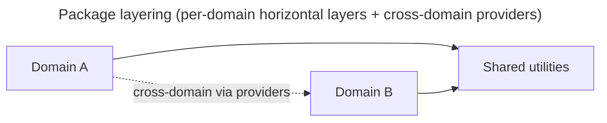

# Architecture

## Purpose

ARCHITECTURE.md is the top-level map of domains, package layering, data flow, and validation surfaces. See matklad's architecture-document convention: it is one line. An agent loading this file should know where each business domain lives, how data flows between domains, and which validation surfaces gate changes.

## Domain Map

- {{domain-name}}: <one-sentence responsibility>
- {{domain-name}}: <one-sentence responsibility>

## Package Layering

Refer to `docs/DESIGN.md` for the canonical layering pattern within each domain. The model organizes code by horizontal layer: presentation (API surface), business logic, data access, and storage. Dependencies flow downward; cross-domain dependencies use provider injection or event dispatch.

## Data Flow

- {{entry-point}} → {{service}} → {{repository}} → {{storage}}: describes the request path and state mutations.
- {{event-source}} → {{queue}} → {{handler}} → {{projection}}: describes event-driven data flow and read-model updates.

## External Integrations

- {{integration-point}}: {{contract-type}} (REST / GraphQL / gRPC / event / file) — {{responsibility}}.
- {{integration-point}}: {{contract-type}} — {{responsibility}}.

## Validation Surfaces

- {{validator-name}}: enforces {{what the surface guards}}.
- {{validator-name}}: enforces {{what the surface guards}}.

## When To Update

- When a new domain is added.
- When a layering rule changes.
- When an external integration is added or replaced.
- When a new validation surface is introduced.

## Required Evidence

- Link to entries under `docs/design-docs/`, `docs/product-specs/`, or `docs/exec-plans/` when those documents are affected.
- Cite the validator config or CI job for each validation surface.
