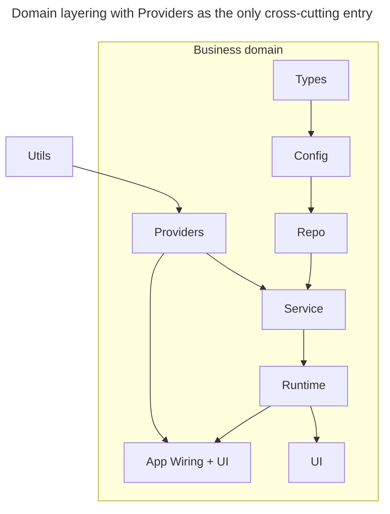

# Design

## Purpose

DESIGN.md captures durable design decisions that span multiple domains: layering constraints, dependency-direction rules, naming conventions, and review criteria that reviewers and agents apply to every change.

## Domain Layering

Organize code into a layered architecture where each layer depends only on layers below it. Types form the foundation; Config builds on Types; Repo accesses Config and Types; Service orchestrates Repo; Runtime executes Service; UI consumes Runtime. Providers enter at multiple layers as the only cross-cutting entry point.

Adapt these layers to your stack and replace the example domain name with your own. Not all layers apply to every domain; name the layers that do and document the skip reasons for the rest.

## Cross-cutting Concerns

Anything that enters the domain from outside MUST come through Providers. Allowed categories:

- Auth and identity providers
- Telemetry and observability
- Feature flags and configuration toggles
- External connectors (databases, APIs, message queues)

Anything else is disallowed by the mechanical enforcement layer.

## Taste Invariants

- **Parse don't validate at boundaries** — Enforce at the entry point where external data enters (Config layer, incoming API handlers). Do not defer to service or repository layers.
- **Structured logging** — Use typed structured logging throughout; enforce via lint or type system.
- **File size cap** — Enforce via lint or structural test that individual source files do not exceed agreed limits.
- **Naming conventions for schemas and types** — Document the naming pattern (e.g., DTO suffix, Request/Response wrapper form) and enforce via type-level checks or lint rules.
- **Error handling discipline** — Require error context (codes, metadata) at domain boundaries; enforce via code review checklist.

## Review Criteria

- Does the change respect the layering rules? No downward dependencies.
- Do new types belong in the Types layer, or should they be nested within a lower layer?
- Do Providers enter only through the documented cross-cutting entry point?
- Does the change follow the project naming conventions?
- Are error handling and logging consistent with project taste?

## When To Update

- When a layering rule changes or a domain adds a new layer.
- When a recurring review comment exposes an undocumented invariant.
- When a domain-spanning decision needs a citable reference under `docs/design-docs/`.

## Required Evidence

- Link to the implementation file or commit where the rule is enforced (lint, type, or runtime check).
- Link to the related entry under `docs/design-docs/` when a deeper decision record exists.
