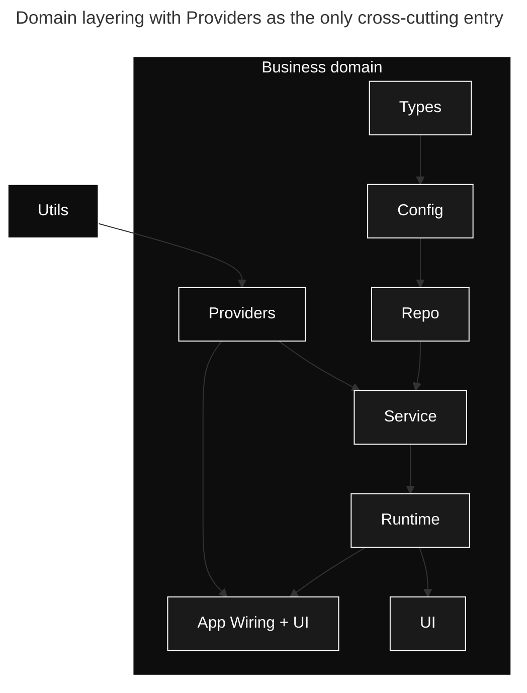

# Design

## Purpose

`DESIGN.md` captures durable design decisions that span multiple domains.
That includes layering constraints, dependency-direction rules, naming conventions, and review criteria that reviewers and agents apply to every change.

## Domain Layering

The canonical pattern is Types → Config → Repo → Service → Runtime → UI plus Providers as the only cross-cutting entry point.
Per-domain deviations MUST be documented under `docs/design-docs/`.

## Cross-cutting Concerns

Anything that enters the domain from outside MUST come through Providers.
Allowed categories:

- Authentication / Authorization: RBAC, session management, and token verification. Enters only through Providers.
- Telemetry: structured logging, OpenTelemetry traces, and metrics. Enters only through Providers.
- Feature flags: feature toggles and configuration flags. Enter only through Providers.
- Connectors: external system clients such as databases, APIs, and message queues. Enter only through Providers.
- Configuration loading and secret resolution: environment parsing, secret access, and configuration assembly. Enter only through Providers.

## Taste Invariants

- Parse don't validate at boundaries. Enforce at the entry point where external data enters.
  - Use `parse-don't-validate` (<https://lexi-lambda.github.io/blog/2019/11/05/parse-don-t-validate/>) as the canonical reference.
- Structured logging only. No `print` / `console.log` in production paths. Enforce via lint.
- Boundary schemas use `<Domain>(Request|Response|Event)` naming. Apply this convention to all boundary types. Enforce via structural test.
- File size cap. Default 400 lines per file. Enforce via custom lint.
- Reject `any` / dynamic-typed values inside domain layer. Reject at type-check time. Enforce via type system.
- Reject silent error swallowing. Every `catch` MUST translate into a typed result or `Finding`. Enforce via structural test.

## Review Criteria

- Does the change preserve domain layering? No downward dependencies allowed.
- Are cross-cutting concerns funneled only through Providers?
- Do new boundary types parse instead of validate?
- Does executable behavior have the smallest useful test, and can prose guidance remain review-only?
- Does the change update documentation under `docs/design-docs/` when it shifts a durable invariant?

## When To Update

- When a layering rule changes or a domain adds a new layer.
- When a recurring review comment exposes an undocumented invariant.
- When a domain-spanning decision needs a citable reference under `docs/design-docs/`.

## Required Evidence

- Link to the implementation file or commit where the rule is enforced (lint, type, or runtime check).
- Link to the related entry under `docs/design-docs/` when a deeper decision record exists.
