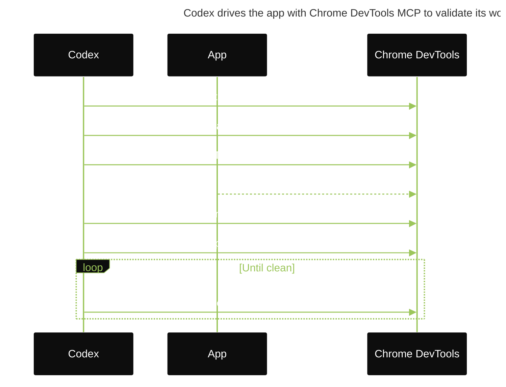
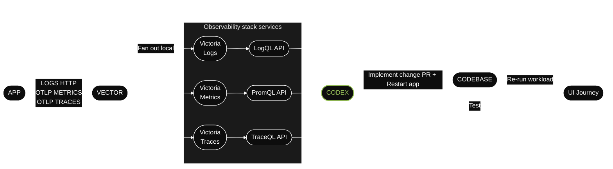
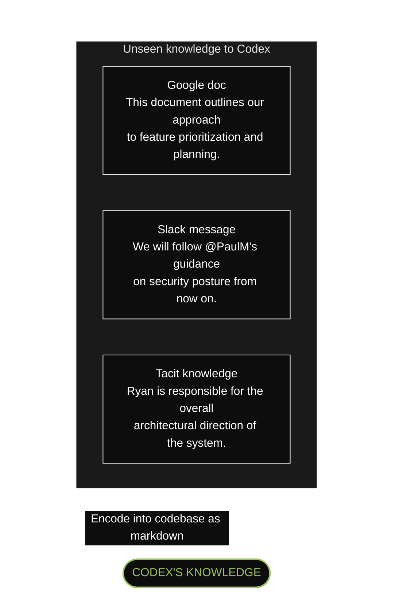
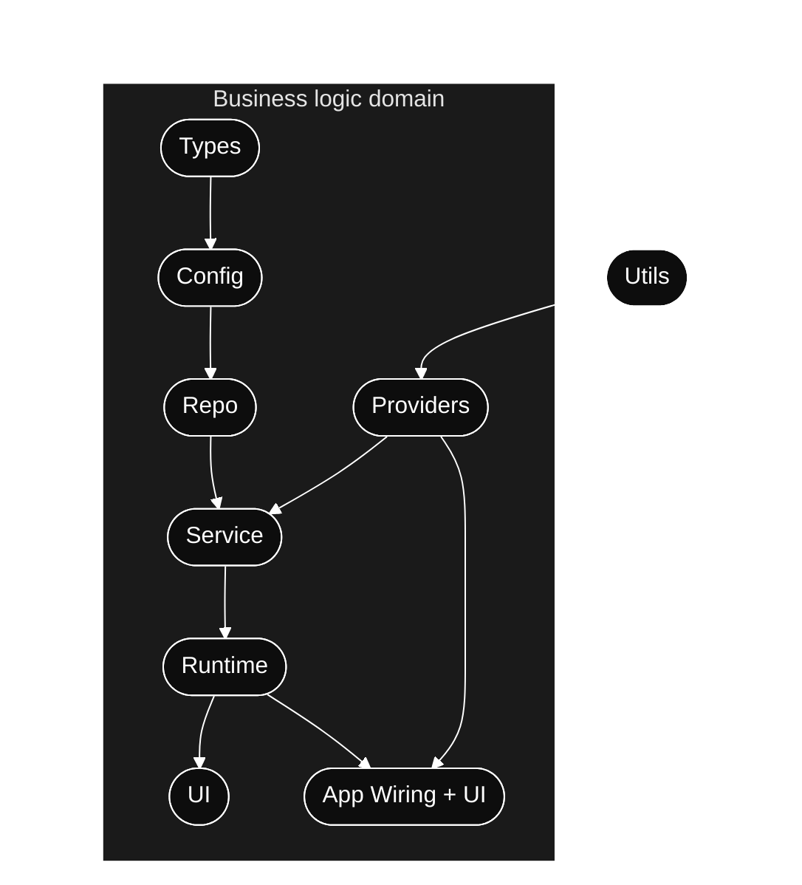

# Harness engineering: leveraging Codex in an agent-first world

> [!NOTE]
>
> Source: OpenAI Engineering blog, by Ryan Lopopolo, Member of the Technical Staff. Published February 11, 2026.
>
> Original URL (English): <https://openai.com/index/harness-engineering/>.
> Korean translation: <https://openai.com/ko-KR/index/harness-engineering/>.
>
> The body below is the English source text reproduced verbatim, including section headings and the in-repository knowledge store layout diagram.
> Copyright remains with OpenAI.
> This document is included because the repository harness installed here follows the `AGENTS.md` table-of-contents pattern.
> It also follows docs-as-record, first-class plans, mechanical enforcement, and continuous doc-gardening.
>
> Editor's note on root-contract naming and symlinks:
> the original post names `AGENTS.md` as the table-of-contents entry point.
> This repository uses `AGENTS.md` as the root contract.
> `CLAUDE.md` is only a Claude Code pointer that imports it.
> Runtime links:
>
> - `.agents/skills/ -> .claude/skills/`.
> - `.codex/agents/ -> .claude/agents/`.
>
> Any reference to `AGENTS.md` or `.agents/` in the body below should be read through that installed runtime layout.
> No other content is altered.

By Ryan Lopopolo, Member of the Technical Staff

Over the past five months, our team has been running an experiment: building and shipping an internal beta of a software product with 0 lines of manually-written code.

The product has internal daily users and external alpha testers. It ships, deploys, breaks, and gets fixed. What's different is that every line of code - application logic, tests, CI configuration, documentation, observability, and internal tooling - has been written by Codex. We estimate that we built this in about 1/10th the time it would have taken to write the code by hand.

Humans steer. Agents execute.

We intentionally chose this constraint so we would build what was necessary to increase engineering velocity by orders of magnitude. We had weeks to ship what ended up being a million lines of code. To do that, we needed to understand what changes when a software engineering team's primary job is no longer to write code, but to design environments, specify intent, and build feedback loops that allow Codex agents to do reliable work.

This post is about what we learned by building a brand new product with a team of agents - what broke, what compounded, and how to maximize our one truly scarce resource: human time and attention.

## We started with an empty git repository

The first commit to an empty repository landed in late August 2025.

The initial scaffold - repository structure, CI configuration, formatting rules, package manager setup, and application framework - was generated by Codex CLI using GPT-5, guided by a small set of existing templates. Even the initial AGENTS.md file that directs agents how to work in the repository was itself written by Codex.

There was no pre-existing human-written code to anchor the system. From the beginning, the repository was shaped by the agent.

Five months later, the repository contains on the order of a million lines of code across application logic, infrastructure, tooling, documentation, and internal developer utilities. Over that period, roughly 1,500 pull requests have been opened and merged with a small team of just three engineers driving Codex. This translates to an average throughput of 3.5 PRs per engineer per day, and surprisingly the throughput has *increased* as the team has grown to now seven engineers. Importantly, this wasn't output for output's sake: the product has been used by hundreds of users internally, including daily internal power users.

Throughout the development process, humans never directly contributed any code. This became a core philosophy for the team: no manually-written code.

## Redefining the role of the engineer

The lack of hands-on human coding introduced a different kind of engineering work, focused on systems, scaffolding, and leverage.

Early progress was slower than we expected because the environment was underspecified. The agent lacked the tools, abstractions, and internal structure required to make progress toward high-level goals. The engineering team focused on enabling agents to do useful work.

In practice, this meant working depth-first: breaking down larger goals into smaller building blocks (design, code, review, test, etc), prompting the agent to construct those blocks, and using them to unlock more complex tasks. When something failed, the fix was almost never "try harder." Because the only way to make progress was to get Codex to do the work, human engineers always stepped into the task and asked: "what capability is missing, and how do we make it both legible and enforceable for the agent?"

Humans interact with the system almost entirely through prompts: an engineer describes a task, runs the agent, and allows it to open a pull request. To drive a PR to completion, we instruct Codex to review its own changes locally, request additional specific agent reviews both locally and in the cloud, respond to any human or agent given feedback, and iterate in a loop until all agent reviewers are satisfied (effectively this is a Ralph Wiggum Loop - <https://ghuntley.com/loop/>). Codex uses our standard development tools directly (gh, local scripts, and repository-embedded skills) to gather context without humans copying and pasting into the CLI.

Humans may review pull requests, but aren't required to. Over time, we've pushed almost all review effort towards being handled agent-to-agent.

## Increasing application legibility

As code throughput increased, our bottleneck became human QA capacity. Because the fixed constraint has been human time and attention, we've worked to add more capabilities to the agent by making things like the application UI, logs, and app metrics themselves directly legible to Codex.

For example, we made the app bootable per git worktree, so Codex could launch and drive one instance per change. We also wired the Chrome DevTools Protocol into the agent runtime and created skills for working with DOM snapshots, screenshots, and navigation. This enabled Codex to reproduce bugs, validate fixes, and reason about UI behavior directly.



We did the same for observability tooling. Logs, metrics, and traces are exposed to Codex via a local observability stack that's ephemeral for any given worktree. Codex works on a fully isolated version of that app - including its logs and metrics, which get torn down once that task is complete. Agents can query logs with LogQL and metrics with PromQL. With this context available, prompts like "ensure service startup completes in under 800ms" or "no span in these four critical user journeys exceeds two seconds" become tractable.



We regularly see single Codex runs work on a single task for upwards of six hours (often while the humans are sleeping).

## We made repository knowledge the system of record

Context management is one of the biggest challenges in making agents effective at large and complex tasks. One of the earliest lessons we learned was simple: give Codex a map, not a 1,000-page instruction manual.

We tried the "one big `AGENTS.md`" approach (<https://agents.md/>). It failed in predictable ways:

- Context is a scarce resource. A giant instruction file crowds out the task, the code, and the relevant docs - so the agent either misses key constraints or starts optimizing for the wrong ones.
- Too much guidance becomes *non-guidance*. When everything is "important," nothing is. Agents end up pattern-matching locally instead of navigating intentionally.
- It rots instantly. A monolithic manual turns into a graveyard of stale rules. Agents can't tell what's still true, humans stop maintaining it, and the file quietly becomes an attractive nuisance.
- It's hard to verify. A single blob doesn't lend itself to mechanical checks (coverage, freshness, ownership, cross-links), so drift is inevitable.

So instead of treating `AGENTS.md` as the encyclopedia, we treat it as the table of contents.

The repository's knowledge base lives in a structured `docs/` directory treated as the system of record. A short `AGENTS.md` (roughly 100 lines) is injected into context and serves primarily as a map, with pointers to deeper sources of truth elsewhere.

Plain Text:

```text
./
+-- AGENTS.md
+-- ARCHITECTURE.md
+-- docs/
    +-- design-docs/
    |   +-- index.md
    |   +-- core-beliefs.md
    |   +-- ...
    +-- exec-plans/
    |   +-- active/
    |   +-- completed/
    |   +-- tech-debt-tracker.md
    +-- generated/
    |   +-- db-schema.md
    +-- product-specs/
    |   +-- index.md
    |   +-- new-user-onboarding.md
    |   +-- ...
    +-- references/
    |   +-- design-system-reference-llms.txt
    |   +-- nixpacks-llms.txt
    |   +-- uv-llms.txt
    |   +-- ...
    +-- DESIGN.md
    +-- FRONTEND.md
    +-- PLANS.md
    +-- PRODUCT_SENSE.md
    +-- QUALITY_SCORE.md
    +-- RELIABILITY.md
    +-- SECURITY.md
```

In-repository knowledge store layout.

Design documentation is catalogued and indexed, including verification status and a set of core beliefs that define agent-first operating principles. Architecture documentation (<https://matklad.github.io/2021/02/06/ARCHITECTURE.md.html>) provides a top-level map of domains and package layering. A quality document grades each product domain and architectural layer, tracking gaps over time.

Plans are treated as first-class artifacts. Ephemeral lightweight plans are used for small changes, while complex work is captured in execution plans (<https://cookbook.openai.com/articles/codex_exec_plans>) with progress and decision logs that are checked into the repository. Active plans, completed plans, and known technical debt are all versioned and co-located, allowing agents to operate without relying on external context.

This enables progressive disclosure: agents start with a small, stable entry point and are taught where to look next, rather than being overwhelmed up front.

We enforce this mechanically. Dedicated linters and CI jobs validate that the knowledge base is up to date, cross-linked, and structured correctly. A recurring "doc-gardening" agent scans for stale or obsolete documentation that does not reflect the real code behavior and opens fix-up pull requests.

## Agent legibility is the goal

As the codebase evolved, Codex's framework for design decisions needed to evolve, too.

Because the repository is entirely agent-generated, it's optimized first for *Codex's* *legibility*. In the same way teams aim to improve navigability of their code for new engineering hires, our human engineers' goal was making it possible for an agent to reason about the full business domain directly from the repository itself.

From the agent's point of view, anything it can't access in-context while running effectively doesn't exist. Knowledge that lives in Google Docs, chat threads, or people's heads are not accessible to the system. Repository-local, versioned artifacts (e.g., code, markdown, schemas, executable plans) are all it can see.



We learned that repo context had to grow over time.
A Slack discussion that aligned the team on an architectural pattern stays illegible to the agent until someone records it in the repository.
The same gap would slow a new hire joining three months later.

Giving Codex more context means organizing and exposing the right information so the agent can reason over it, rather than overwhelming it with ad-hoc instructions. In the same way you would onboard a new teammate on product principles, engineering norms, and team culture (emoji preferences included), giving the agent this information leads to better-aligned output.

This framing clarified many tradeoffs. We favored dependencies and abstractions that could be fully internalized and reasoned about in-repo. Technologies often described as "boring" tend to be easier for agents to model due to composability, api stability, and representation in the training set. In some cases, it was cheaper to have the agent reimplement subsets of functionality than to work around opaque upstream behavior from public libraries. For example, rather than pulling in a generic `p-limit`-style package, we implemented our own map-with-concurrency helper: it's tightly integrated with our OpenTelemetry instrumentation, has 100% test coverage, and behaves exactly the way our runtime expects.

Pulling more of the system into a form the agent can inspect, validate, and modify directly increases leverage for Codex and other agents (e.g. Aardvark) working on the codebase.

## Enforcing architecture and taste

Documentation alone doesn't keep a fully agent-generated codebase coherent. Mechanical invariants let agents ship fast while preserving the foundation. For example, we require Codex to parse data shapes at the boundary (<https://lexi-lambda.github.io/blog/2019/11/05/parse-don-t-validate/>) and leave the implementation choice open.

Agents are most effective in environments with strict boundaries and predictable structure (<https://bits.logic.inc/p/ai-is-forcing-us-to-write-good-code>), so we built the application around a rigid architectural model. Each business domain is divided into a fixed set of layers, with strictly validated dependency directions and a limited set of permissible edges. These constraints are enforced mechanically via custom linters (Codex-generated, of course!) and structural tests.

The diagram below shows the rule: within each business domain (e.g. App Settings), code can only depend "forward" through a fixed set of layers (Types → Config → Repo → Service → Runtime → UI). Cross-cutting concerns (auth, connectors, telemetry, feature flags) enter through a single explicit interface: Providers. Anything else is disallowed and enforced mechanically.



This is the kind of architecture you usually postpone until you have hundreds of engineers. With coding agents, it's an early prerequisite: the constraints are what allows speed without decay or architectural drift.

In practice, we enforce these rules with custom linters and structural tests, plus a small set of "taste invariants." For example, we statically enforce structured logging, naming conventions for schemas and types, file size limits, and platform-specific reliability requirements with custom lints. Because the lints are custom, we write the error messages to inject remediation instructions into agent context.

In a human-first workflow, these rules might feel pedantic or constraining. With agents, they become multipliers: once encoded, they apply everywhere at once.

At the same time, we're explicit about where constraints matter and where they do not. This resembles leading a large engineering platform organization: enforce boundaries centrally, allow autonomy locally. You care deeply about boundaries, correctness, and reproducibility. Within those boundaries, you allow teams - or agents - significant freedom in how solutions are expressed.

The resulting code does not always match human stylistic preferences, and that's okay. As long as the output is correct, maintainable, and legible to future agent runs, it meets the bar.

Human taste is fed back into the system continuously. Review comments, refactoring pull requests, and user-facing bugs are captured as documentation updates or encoded directly into tooling. When documentation falls short, we promote the rule into code.

## Throughput changes the merge philosophy

As Codex's throughput increased, many conventional engineering norms became counterproductive.

The repository operates with minimal blocking merge gates. Pull requests are short-lived. Test flakes are often addressed with follow-up runs rather than blocking progress indefinitely. In a system where agent throughput far exceeds human attention, corrections are cheap, and waiting is expensive.

This would be irresponsible in a low-throughput environment. Here, it's often the right tradeoff.

## What "agent-generated" actually means

When we say the codebase is generated by Codex agents, we mean everything in the codebase.

Agents produce:

- Product code and tests
- CI configuration and release tooling
- Internal developer tools
- Documentation and design history
- Evaluation harnesses
- Review comments and responses
- Scripts that manage the repository itself
- Production dashboard definition files

Humans always remain in the loop, but work at a different layer of abstraction than we used to. We prioritize work, translate user feedback into acceptance criteria, and validate outcomes. When the agent struggles, we treat it as a signal: identify what is missing - tools, guardrails, documentation - and feed it back into the repository, always by having Codex itself write the fix.

Agents use our standard development tools directly. They pull review feedback, respond inline, push updates, and often squash and merge their own pull requests.

## Increasing levels of autonomy

As more of the development loop was encoded directly into the system - testing, validation, review, feedback handling, and recovery - the repository recently crossed a meaningful threshold where Codex can end-to-end drive a new feature.

Given a single prompt, the agent can now:

- Validate the current state of the codebase
- Reproduce a reported bug
- Record a video demonstrating the failure
- Implement a fix
- Validate the fix by driving the application
- Record a second video demonstrating the resolution
- Open a pull request
- Respond to agent and human feedback
- Detect and remediate build failures
- Escalate to a human only when judgment is required
- Merge the change

This behavior depends heavily on the specific structure and tooling of this repository and should not be assumed to generalize without similar investment - at least, not yet.

## Entropy and garbage collection

Full agent autonomy also introduces novel problems. Codex replicates patterns that already exist in the repository - even uneven or suboptimal ones. Over time, this inevitably leads to drift.

Initially, humans addressed this manually. Our team used to spend every Friday (20% of the week) cleaning up "AI slop." Unsurprisingly, that didn't scale.

Instead, we started encoding what we call "golden principles" directly into the repository and built a recurring cleanup process. These principles are opinionated, mechanical rules that keep the codebase legible and consistent for future agent runs. For example: (1) we prefer shared utility packages over hand-rolled helpers to keep invariants centralized, and (2) we don't probe data "YOLO-style" - we validate boundaries or rely on typed SDKs so the agent can't accidentally build on guessed shapes. On a regular cadence, we have a set of background Codex tasks that scan for deviations, update quality grades, and open targeted refactoring pull requests. Most of these can be reviewed in under a minute and automerged.

This functions like garbage collection. Technical debt is like a high-interest loan: it's almost always better to pay it down continuously in small increments than to let it compound and tackle it in painful bursts. Human taste is captured once, then enforced continuously on every line of code. This also lets us catch and resolve bad patterns on a daily basis, rather than letting them spread in the code base for days or weeks.

## What we're still learning

This strategy has so far worked well up through internal launch and adoption at OpenAI. Building a real product for real users helped anchor our investments in reality and guide us towards long-term maintainability.

What we don't yet know is how architectural coherence evolves over years in a fully agent-generated system. We're still learning where human judgment adds the most leverage and how to encode that judgment so it compounds. We also don't know how this system will evolve as models continue to become more capable over time.

What's become clear: building software still demands discipline, but the discipline shows up more in the scaffolding rather than the code. The tooling, abstractions, and feedback loops that keep the codebase coherent are increasingly important.

Our most difficult challenges now center on designing environments, feedback loops, and control systems that help agents accomplish our goal: build and maintain complex, reliable software at scale.

As agents like Codex take on larger portions of the software lifecycle, these questions will matter even more. We hope that sharing some early lessons helps you reason about where to invest your effort so you can just build things.

## Acknowledgements

Special thanks to Victor Zhu and Zach Brock who contributed to the post, as well as to the entire team that built this new product.
