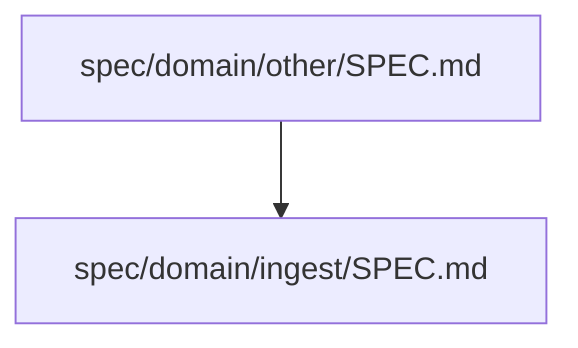

## Principles

- Frontmatter `call` MUST be the authoritative source of SPEC dependencies.
- Outbound links MUST be maintained as one-way references from the caller only.
- Frontmatter `call` is SPEC-to-SPEC only. Each item MUST point to an existing `SPEC.md` file. Links to other files (for example, `CONTRACT.md`, `openapi.yaml`) MUST NOT be used.
- Frontmatter `call` entries MUST use relative paths.
- Spec body markdown links MAY explain context, but MUST NOT be used as dependency ownership data.
- Each SPEC.md MUST include a `call: []` frontmatter field, even when there are no outbound references.
- Reverse-direction points (backlinks / "called by" lists) MUST NOT be used.
- Inbound relationships MUST be derived from frontmatter `call` via scripts and diagram generation.

Open this guide only when you need detailed link-editing or inbound-query procedures beyond the ordinary path in `../SKILL.md`.

## Table of Contents

- [Adding a Link](#adding-a-link)
- [Removing a Link](#removing-a-link)
- [Deleting a Spec](#deleting-a-spec)
- [Link Paths](#link-paths)
- [Forbidden Link Targets](#forbidden-link-targets)
- [Link Validation](#link-validation)
- [Reverse Reference Query](#reverse-reference-query)
- [Cross-Hierarchy Links](#cross-hierarchy-links)

## Adding a Link

When SPEC A references SPEC B:

1. In SPEC A frontmatter, add outbound reference.
   String form (preferred):

    ```yaml
    call:
      - ./ingest/SPEC.md
    ```

   Object form (also valid):

    ```yaml
    call:
      - path: ./ingest/SPEC.md
    ```

1. In SPEC B, reverse-direction points MUST NOT be added.
   The following MUST NOT be added:

   - a "Called By" / "Incoming links" list
   - any frontmatter call entry that exists only to mirror A -> B

   If callers of SPEC B are needed, they SHOULD be queried instead:

    ```bash
    "${SKILL_ROOT}/scripts/sdd.sh" list-frontmatter ./spec --inbound-of spec/domain/ingest/SPEC.md
    ```

## Removing a Link

When removing a link from SPEC A to SPEC B, only the outbound reference in SPEC A MUST be removed.

## Deleting a Spec

When deleting a spec, all links pointing to it MUST be removed from every referencing spec.

To find those references, query inbound callers:

```bash
"${SKILL_ROOT}/scripts/sdd.sh" list-frontmatter ./spec --inbound-of spec/domain/ingest/SPEC.md
```

## Link Paths

Relative paths from the current `SPEC.md` location MUST be used.

These examples use canonical `spec/domain/...` paths for illustration.

> [!NOTE]
> The examples below use canonical paths for clarity. They do not redefine canonical top-level SPEC structure policy.

| Source | Target | Relative path in link |
| --- | --- | --- |
| `spec/domain/SPEC.md` | `spec/domain/ingest/SPEC.md` | `./ingest/SPEC.md` |
| `spec/domain/SPEC.md` | `spec/domain/other/SPEC.md` | `./other/SPEC.md` |
| `spec/domain/ingest/SPEC.md` | `spec/domain/SPEC.md` | `../SPEC.md` |
| `spec/domain/ingest/SPEC.md` | `spec/domain/other/deep/SPEC.md` | |
| | | `../other/deep/SPEC.md` |

## Forbidden Link Targets

Frontmatter `call` MUST reference `SPEC.md` only. Non-SPEC documents MUST NOT be linked, even when adjacent.

Forbidden examples:

- `./CONTRACT.md`
- `./openapi.yaml`
- `../other/README.md`
- external URLs

## Link Validation

`"${SKILL_ROOT}/scripts/sdd.sh" validate ./spec` validates linking rules:

- frontmatter `call` MUST exist (`call: []` allowed)
- each `call` entry MUST be a relative path
- each `call` target MUST point to an existing file
- each `call` target MUST be `SPEC.md` (SPEC-to-SPEC only)

## Reverse Reference Query

Reverse references are derived from frontmatter `call`. `"${SKILL_ROOT}/scripts/sdd.sh" list-frontmatter` with `--inbound-of` SHOULD be used to query callers of a target spec.

Examples:

- `"${SKILL_ROOT}/scripts/sdd.sh" list-frontmatter ./spec --inbound-of spec/domain/ingest/SPEC.md`
- `"${SKILL_ROOT}/scripts/sdd.sh" list-frontmatter ./spec --inbound-of spec/domain/ingest/SPEC.md --jsonl`

## Cross-Hierarchy Links

Specs in different branches of the hierarchy MAY link to each other. These links SHOULD be displayed as normal call edges in the mermaid diagram.


